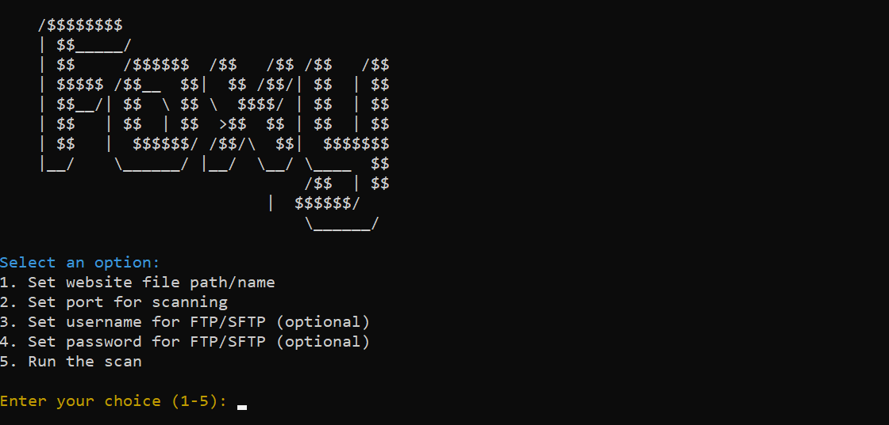

# Bulk Nmap Scan & FTP Tester



**Bulk Nmap Scan & FTP Tester** is a Python script designed for performing bulk Nmap scans and testing FTP/SFTP connections on multiple websites. This tool helps you automate the process of scanning for open ports and validating FTP/SFTP connections efficiently.

## Features

- **Bulk Nmap Scanning:** Scan multiple websites for open ports using Nmap.
- **FTP Testing:** Test FTP connections on port 21.
- **SFTP Testing:** Optionally test SFTP connections on port 22.
- **User Input Prompts:** Prompt user for confirmation before running SFTP tests.
- **Dependency Management:** Automatically installs required Python packages.
- **Admin Rights Check:** Ensures the script is run with administrative privileges on Windows.
- **Progress Indication:** Displays progress while scanning websites using `tqdm`.

## Installation

1. **Clone the Repository:**

    ```bash
    git https://github.com/rubahilang/Bulk-Nmap-Scan-FTP-Tester
    ```

2. **Navigate to the Project Directory:**

    ```bash
    cd Bulk-Nmap-Scan-FTP-Tester
    ```

3. **Install Required Packages:**

    The script will automatically install the required Python packages if they are not already installed. However, you can manually install them using:

    ```bash
    pip install colorama tqdm paramiko
    ```

4. **Ensure you have Nmap installed on your system.** On Windows, use:

    ```bash
    winget install --id Insecure.Nmap --source winget
    ```

    On Linux or macOS, install Nmap using your package manager. For example, on Ubuntu:

    ```bash
    sudo apt-get install nmap
    ```

## Usage

1. **Run the Script:**

    On Windows, use the `run.bat` file:

    ```bash
    run.bat
    ```

    On Linux or macOS, use the `run.sh` file:

    ```bash
    bash run.sh
    ```

2. **Follow the Prompts:**

    - Set the file path for the websites you want to scan.
    - Specify the ports for scanning.
    - Optionally, provide username and password for FTP/SFTP testing.
    - Choose to test FTP or SFTP connections as required.

3. **View Results:**

    Results will be displayed in the terminal and saved to `websites_with_open_ports.txt` if any open ports are found.

## Contributing

Feel free to open issues or submit pull requests. Contributions are welcome!

## Contact

For any questions or feedback, please reach out to [rubahilang@gmail.com](mailto:rubahilang@gmail.com) or follow me on [Instagram](https://instagram.com/rubahilang).
